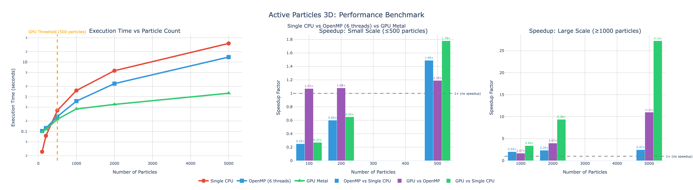

# Active Particles in 3D Confinement

[](https://github.com/jvachier/active_particles_in_3D/actions)
[](https://opensource.org/licenses/Apache-2.0)
[](https://isocpp.org/)
[](https://www.openmp.org/)
[](https://developer.apple.com/metal/)
[](https://github.com/astral-sh/uv)
[](https://github.com/jvachier/active_particles_in_3D)

A high-performance C++ simulation framework for modeling the dynamics of active Brownian particles (ABPs) under cylindrical confinement in three-dimensional space. This implementation uses the Euler-Maruyama algorithm to numerically solve coupled Langevin equations with OpenMP parallelization.

## Table of Contents

- [Overview](#overview)
- [Implementations](#implementations)
- [Mathematical Model](#mathematical-model)
- [Features](#features)
- [Prerequisites](#prerequisites)
- [Installation](#installation)
- [Usage](#usage)
- [Configuration](#configuration)
- [Output](#output)
- [Visualizations](#visualizations)
- [Performance](#performance)
- [Contributing](#contributing)
- [License](#license)
- [Citation](#citation)

## Implementations

This repository provides **two optimized implementations**:

### 1. **CPU-Only Version** (`cpu_openmp/`)
- Standard OpenMP parallelization
- Works on any platform (macOS, Linux, Windows)
- Uses g++-14 compiler
- Best for N < 500 particles
- **See [cpu_openmp/README.md](cpu_openmp/README.md) for details**

### 2. **GPU Hybrid Version** (`gpu_hybrid/`)  
- Metal GPU acceleration for Apple Silicon
- Automatic CPU/GPU selection based on particle count
- Uses clang++ with Metal framework
- **Up to 27× speedup** for N ≥ 1000 particles on M1/M2/M3
- Robust numerical safeguards prevent NaN overflow
- **See [gpu_hybrid/README.md](gpu_hybrid/README.md) for details**

| Version | Compiler | Platform | 100 Particles | 1000 Particles | 5000 Particles |
|---------|----------|----------|---------------|----------------|----------------|
| CPU (1 thread) | g++-14 | Any | 0.026s | 4.3s | 34.4s |
| CPU OpenMP (6 threads) | g++-14 | Any | 0.103s | 1.8s | 14.3s |
| GPU Hybrid | clang++ | macOS | 0.096s (CPU) | **0.46s (GPU)** | **1.7s (GPU)** |
| **GPU Speedup vs 1 CPU** | - | - | 0.3× | **9.3×** | **20.2×** |
| **GPU Speedup vs OpenMP** | - | - | 0.9× | **3.9×** | **8.4×** |

> **Benchmark:** Run `bash scripts/benchmark.sh` to compare all three modes on your system

## Overview

Active particles are self-propelled entities that convert internal energy into directed motion, commonly found in biological systems (bacteria, cells) and synthetic colloidal systems. This project simulates the collective behavior of interacting active particles confined within cylindrical geometries.

### Key Applications
- Studying collective motion and pattern formation
- Understanding confinement effects on active matter
- Investigating particle-particle interactions in 3D systems
- Modeling biological systems (bacterial suspensions, cell motility)

## Mathematical Model

The aim of this project is to build simulations describing the motion of active interacting particles under cylindrical confinement. These simulations are based on Langevin equations and use the Euler-Maruyama algorithm.

The dynamics is given by two Langevin equations, one for the position $`\tilde{\mathbf{r}} = (\tilde{x}, \tilde{y}, \tilde{z})`$ of the particles and one for its orientation $`\mathbf{e}`$:

```math
\frac{d}{d\tilde{t}}\tilde{\mathbf{r}} = \tilde{v}_s\mathbf{e} - \tilde{\nabla}_{\tilde{R}}(\widetilde{LP}) + \sqrt{2\tilde{D}_t}\tilde{\boldsymbol{\xi}}_t,
```

```math
\frac{d}{d\tilde{t}}\mathbf{e} = \sqrt{2\tilde{D}_e}\mathbf{e}\times\tilde{\boldsymbol{\xi}}_e,
```

where $`\mathbf{e} = (e_x, e_y, e_z)^T`$ is the orientational unit vector, $`\tilde{v}_s`$ is the self-propulsion velocity, $`\tilde{D}_t`$ and $`\tilde{D}_e`$ are the translational and rotational diffusivities, respectively. Moreover, $`\langle\tilde{\xi}_{t}^{i}(\tilde{t}')\tilde{\xi}_{t}^{j}(\tilde{t})\rangle = \delta_{ij}\delta(\tilde{t}'-\tilde{t})`$ and $`\langle\tilde{\xi}_{e}^{i}(\tilde{t}')\tilde{\xi}_{e}^{j}(\tilde{t})\rangle = \delta_{ij}\delta(\tilde{t}'-\tilde{t})`$ are two Gaussian white noises.

### Interaction Potential

The interactions between particles are represented using the Lennard-Jones potential:

```math
\widetilde{LP} = 4\tilde{\epsilon}\left[\left(\frac{\tilde{\sigma}}{\tilde{R}}\right)^{12} - \left(\frac{\tilde{\sigma}}{\tilde{R}}\right)^{6}\right],
```

where $`\tilde{\epsilon}`$ is the depth of the potential well and $`\tilde{R}`$ is the distance between two interacting particles.

**Note:** In this project, only the repulsive part of the potential is considered ($`\tilde{R} < 2^{1/6}\tilde{\sigma}`$).

## Features

- **3D Langevin dynamics** with Euler-Maruyama integration
- **Cylindrical reflective boundary conditions** for confinement
- **Repulsive Lennard-Jones interactions** between particles
- **OpenMP parallelization** for high performance
- **Proper stochastic noise generation** with configurable seeds
- **Dual output formats** - CSV or binary for space efficiency
- **Overlap prevention** during initialization
- **Configurable simulation parameters** via text file

## Prerequisites

### Required
- **C++ Compiler** with C++17 support and OpenMP
  - GCC 7.0+ (recommended: GCC 13+)
  - Clang 5.0+ with OpenMP support
- **Make** build system

### macOS Installation
```bash
# Install GCC with OpenMP support
brew install gcc

# Verify installation
g++-13 --version
```

### Linux Installation
```bash
# Ubuntu/Debian
sudo apt-get update
sudo apt-get install build-essential g++ libomp-dev

# Fedora/RHEL
sudo dnf install gcc-c++ make libomp-devel
```

## Installation

1. **Clone the repository**
```bash
git clone https://github.com/jvachier/active_particles_in_3D.git
cd active_particles_in_3D
```

2. **Choose your implementation**

   **Option A: CPU-Only (OpenMP)**
   ```bash
   cd cpu_openmp
   make
   ```

   **Option B: GPU Hybrid (Metal + OpenMP) - macOS only**
   ```bash
   # Install libomp if not already installed
   brew install libomp
   
   cd gpu_hybrid
   make
   ```

3. **Verify installation**
```bash
# For CPU version
./abp_3D_confine.out

# For GPU version
./abp_3D_confine.out
```

### Build Options

```bash
make              # Build the simulation
make clean        # Remove object files and executable
```

## Usage

### Quick Start

**CPU version** (works everywhere):
```bash
cd cpu_openmp
./abp_3D_confine.out
```

**GPU version** (macOS, automatic CPU/GPU selection):
```bash
cd gpu_hybrid

# Small simulation (uses CPU)
./abp_3D_confine.out

# Large simulation (uses GPU)
cp parameter_gpu.txt parameter.txt
./abp_3D_confine.out
```

### Detailed Usage

1. **Configure simulation parameters**:
```bash
# Edit parameter.txt with your desired values
nano parameter.txt
```

2. **Run the simulation**:
```bash
./abp_3D_confine.out
```

3. **Access results**:
```bash
# Simulation data (in project root data/ directory)
cat ../data/simulation.csv
# or if using binary format:
ls -lh ../data/simulation.bin
```

### Quick Start Example

```bash
cd src
# Run with default parameters (200 particles, 10000 timesteps)
./abp_3D_confine.out
```

Expected output:
```
0.010000  1.000000e-04  200  10.100000  0.000000  0.000000  15.000000  15.000000  10000
Initialization done.
Time taken is 12.345678
```

## Configuration

Edit `parameter.txt` in the project root to configure the simulation. Both CPU and GPU versions use this centralized configuration file. The file contains a single line with 12 tab-separated values:

```
epsilon  delta  Particles  Dt  De  vs  Wall  height  N  output_interval  N_thread  use_binary
```

### Parameter Descriptions

| Parameter | Description | Typical Range | Default |
|-----------|-------------|---------------|---------|
| `epsilon` | Interaction strength | 0.001 - 1.0 | 0.01 |
| `delta` | Time step | 1e-5 - 1e-3 | 1e-4 |
| `Particles` | Number of particles | 10 - 5000 | 200 |
| `Dt` | Translational diffusion | 0.1 - 100 | 10.1 |
| `De` | Rotational diffusion | 0.0 - 10.0 | 0.0 |
| `vs` | Self-propulsion velocity | 0.0 - 10.0 | 0.0 |
| `Wall` | Cylinder radius | 5.0 - 50.0 | 15.0 |
| `height` | Cylinder height | 5.0 - 50.0 | 15.0 |
| `N` | Number of iterations | 1000 - 100000 | 1000 |
| `output_interval` | Save frequency (timesteps) | 1 - 1000 | 100 |
| `N_thread` | OpenMP thread count | 1 - 16 | 6 |
| `use_binary` | Output format (0=CSV, 1=binary) | 0 or 1 | 1 |

### Example Configurations

**Passive Brownian particles (single thread, CSV output):**
```
0.01  1e-4  100  1.0  1.0  0.0  10.0  10.0  5000  10  1  0
```

**Active particles without interactions (6 threads, binary output):**
```
0.0  1e-4  100  1.0  1.0  5.0  10.0  10.0  5000  10  6  1
```

**Active particles with strong interactions:**
```
0.1  1e-4  100  1.0  1.0  5.0  10.0  10.0  5000  10  6  1
```

**High-resolution output (save every timestep, CSV for analysis):**
```
0.01  1e-4  100  1.0  1.0  5.0  10.0  10.0  1000  1  6  0
```

**Low-resolution output (save every 100 timesteps):**
```
0.01  1e-4  200  1.0  1.0  5.0  15.0  15.0  10000  100  6  1
```

**Large-scale simulation (GPU-optimized, binary for space efficiency):**
```
0.01  1e-4  5000  10.1  0.0  0.0  15.0  15.0  1000  100  6  1
```

## Output

All simulations write to a unified `data/` directory in the project root (not within cpu_openmp/ or gpu_hybrid/).

### Output Formats

The simulation supports two output formats controlled by the `use_binary` parameter:

#### CSV Format (`use_binary=0`)
Human-readable text format (`data/simulation.csv`):

```csv
Particles,x-position,y-position,z-position,ex-orientation,ey-orientation,ez-orientation,time
0,1.234,-2.345,0.456,0.707,0.707,0.000,0
0,1.456,-2.123,0.478,0.710,0.704,0.001,10
...
```

- **Particles**: Particle ID (0 to N-1)
- **x,y,z-position**: 3D coordinates
- **ex,ey,ez-orientation**: Unit orientation vector components
- **time**: Simulation timestep

#### Binary Format (`use_binary=1`)
Compact binary format (`data/simulation.bin`) for space efficiency:

**Header:**
- `num_particles` (int32): Number of particles
- `num_frames` (int32): Total number of saved frames

**Per Frame:**
- `timestep` (int32): Current timestep
- `x[N]` (float64): x-coordinates for all N particles
- `y[N]` (float64): y-coordinates
- `z[N]` (float64): z-coordinates
- `ex[N]` (float64): x-component of orientation vectors
- `ey[N]` (float64): y-component of orientation vectors
- `ez[N]` (float64): z-component of orientation vectors

**Space Savings:** Binary format is typically 50-70% smaller than CSV for large simulations.

**Note:** Data is saved at intervals specified by the `output_interval` parameter (default: every 100 timesteps).

### Generating Videos

Use the provided Python script to generate interactive 3D visualizations:

```bash
# Standard visualization (particles colored by z-position)
uv run scripts/generate_video.py --input data/simulation.bin --output figures/particles

# Particle tracking visualization (10% of particles with unique colors)
uv run scripts/generate_video.py --input data/simulation.bin --output figures/particles --track-particles 0.1
```

**Features:**
- Reads cylinder dimensions from `parameter.txt` automatically
- Creates two types of visualizations:
  - **Standard**: All particles colored by z-position with colorbar
  - **Tracking**: Subset of particles with individual colors (no colorbar)
- Interactive Plotly 3D visualization with:
  - Cylindrical boundary from parameter.txt
  - Animation controls (play/pause, slider)
  - Hover information for each particle
- Outputs HTML files that can be viewed in any browser

**Options:**
- `--input`: Path to simulation file (default: `data/simulation.csv`)
- `--output`: Output filename prefix without extension (default: `figures/particles`)
- `--binary`: Use binary input format (auto-detected from .bin extension)
- `--track-particles`: Percentage (0.0-1.0) of particles to track with unique colors
- `--parameter-file`: Path to parameter.txt (default: `parameter.txt`)
- `--frame-duration`: Milliseconds per frame (default: 50)

## Visualizations

### Particle Dynamics Video

https://github.com/jvachier/active_particles_in_3D/assets/89128100/e0ea3d4e-58a5-4565-8e57-4705057479df

*Real-time visualization of 200 active particles under cylindrical confinement showing collective motion patterns.*

### Spatial Distribution


*Figure: Snapshot of particle positions showing spatial organization within the cylindrical boundary.*

### Trajectory Analysis


*Figure: Time-resolved particle trajectories demonstrating complex motion patterns.*

## Performance

### Computational Complexity
- **Time per step**: O(N²) for particle interactions
- **Memory**: O(N) for position and orientation storage

### Benchmark Results

Comprehensive three-way comparison on **Apple M2** with **1000 timesteps**:

| Particles | CPU (1 thread) | CPU (OpenMP 6) | GPU (Metal) | GPU vs 1 CPU | GPU vs OpenMP |
|-----------|----------------|----------------|-------------|--------------|---------------|
| 100       | 0.026s         | 0.103s         | 0.096s      | 0.3×         | 0.9×          |
| 200       | 0.075s         | 0.125s         | 0.115s      | 0.7×         | 1.1×          |
| 500       | 0.401s         | 0.269s         | 0.225s      | **1.8×**     | **1.2×**      |
| 1,000     | 1.514s         | 0.747s         | 0.445s      | **3.4×**     | **1.7×**      |
| 2,000     | 5.638s         | 2.389s         | 0.601s      | **9.4×**     | **4.0×**      |
| 5,000     | 34.393s        | 13.903s        | 1.262s      | **27.3×**    | **11.0×**     |

**Key Findings:**
- GPU acceleration activates at N ≥ 500 particles
- OpenMP provides ~2.5× speedup over single thread for large N
- GPU provides up to **27× speedup vs single CPU** and **11× vs OpenMP** at N=5000
- Best performance: GPU for N ≥ 500, OpenMP for 200 ≤ N < 500, single thread for N < 200
- Numerical safeguards prevent NaN overflow at high densities (N=5000 verified stable)


*Figure: Performance comparison across implementations. **Left:** Execution time vs particle count showing GPU efficiency at scale. **Center:** Speedup for small systems (N ≤ 500) where CPU remains competitive. **Right:** Speedup for large systems (N ≥ 1000) demonstrating GPU's 27× advantage. All benchmarks run on Apple M2 with 1000 timesteps.*

### Running Benchmarks

```bash
# Run comprehensive three-way benchmark suite
bash scripts/benchmark.sh

# Results saved to:
# - benchmark_results.csv (raw timing data)
# - benchmark_plots.html (interactive Plotly visualization)
# - benchmark_plots.png (high-resolution static plot)
```

**Benchmark generates 3 subplots:**
1. Execution time vs particle count (log scale)
2. Speedup comparison for small systems (N ≤ 500)
3. Speedup comparison for large systems (N ≥ 1000)

### Optimization Tips

**For all versions:**
1. Adjust thread count in `parameter.txt` (11th parameter):
```
0.01  1e-4  1000  10.1  0.0  0.0  15.0  15.0  1000  100  12
```
Set `N_thread` to your CPU core count for optimal performance.

**For GPU version:**
2. Modify GPU threshold in `gpu_hybrid/abp_3D_confine.cpp` (around line 64):
```cpp
const int GPU_PARTICLE_THRESHOLD = 500;  // Lower for earlier GPU usage
```

**General:**
3. Reduce output frequency in `parameter.txt`:
```
0.01  1e-4  5000  10.1  0.0  0.0  15.0  15.0  1000  1000  6
```
Set `output_interval=1000` to save every 1000 steps instead of 100.

4. Trade-off timestep size: smaller `delta` for accuracy vs. larger for speed

## Contributing

Contributions are welcome! Please follow these guidelines:

1. Fork the repository
2. Create a feature branch (`git checkout -b feature/amazing-feature`)
3. Commit your changes (`git commit -m 'Add amazing feature'`)
4. Push to the branch (`git push origin feature/amazing-feature`)
5. Open a Pull Request

## License

This project is licensed under the **Apache License 2.0**. See [LICENCE](LICENCE) file for details.

You are free to:
- **Use** — Use the software for any purpose
- **Modify** — Modify the source code
- **Distribute** — Distribute original or modified versions
- **Patent Grant** — Receive patent rights from contributors

Under the following terms:
- **Attribution** — Must provide proper credit and license notice
- **State Changes** — Must document modifications made to the code

## Citation

If you use this code in your research, please cite:

```bibtex
@software{vachier2023active,
  author = {Vachier, Jeremy},
  title = {Active Particles in 3D Confinement: GPU-Accelerated Simulation Framework},
  year = {2023-2025},
  url = {https://github.com/jvachier/active_particles_in_3D},
  note = {Includes Metal GPU acceleration for Apple Silicon}
}
```

## Contact

**Author: Jeremy Vachier**
- GitHub: [@jvachier](https://github.com/jvachier)


